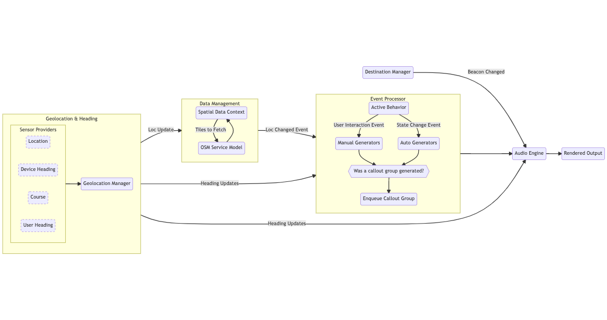

# iOS Client Overview

Soundscape is a medium sized iOS application which can be hard to understand for new engineers onboarding to the codebase. This document is intended to give a high level overview of the architecture of the application, and subsequent wiki pages under the "iOS" directory describe the individual components in more detail. Please contribute to this wiki if you find information that is out of date or missing!

## Client Pipeline Architecture

This diagram shows the core pipeline of the Soundscape architecture. Many details are omitted for clarity and brevity. This diagram excludes all of the Soundscape visual UI implementation details and only shows the core underlying business logic and audio UI.

::: mermaid
flowchart LR
    subgraph GeolocationManager["Geolocation & Heading"]
        direction LR
        subgraph Sensors["Sensor Providers"]
            direction LR
            loc(Location)
            dev(Device Heading)
            course(Course)
            user(User Heading)
            style loc stroke-dasharray: 5 5
            style dev stroke-dasharray: 5 5
            style course stroke-dasharray: 5 5
            style user stroke-dasharray: 5 5
        end
        Sensors --> geo(Geolocation Manager)
    end
    subgraph DataManagement["Data Management"]
        direction TB
        data(Spatial Data Context) --Tiles to Fetch--> osm(OSM Service Model) --> data
    end
    subgraph EventProcessor["Event Processor"]
        direction TB
        active(Active Behavior) --User Interaction Event--> manual(Manual Generators)
        active --State Change Event--> auto(Auto Generators)
        manual --> queue{{Was a callout group generated?}}
        auto --> queue
        queue --> enqueue(Enqueue Callout Group)
    end
    GeolocationManager --Loc Update--> DataManagement
    DataManagement --Loc Changed Event--> EventProcessor
    GeolocationManager --Heading Updates--> EventProcessor
    EventProcessor --> audio(Audio Engine)
    dest(Destination Manager) --Beacon Changed--> audio
    GeolocationManager --Heading Updates--> audio
    audio --> out(Rendered Output)
:::

## Geolocation & Heading

The `GeolocationManager` class is responsible for organizing sensor data providers for the user's location and orientation and piping this data to the rest of the app. By default,  `CoreLocationManager` is the registered as the initial location provider, device heading provider, and course provider in `GeolocationManager`. `CoreLocationManager` uses the Core Location framework to obtain the user's latitude/longitude, GPS course, and compass heading (what we refer to as "device heading"). `GeolocationManager` allows for additional objects that provide location and heading updates (a.k.a. "sensor providers") to be substituted in for the default `CoreLocationManager` provider. This is useful for simulating the user's location (see `GPXSimulator`). Read more about the `GeolocationManager` [here](/iOS-Client/Features-&-Components/Geolocation-Manager).

When the user has supported head-tracking headphones connected (e.g., Apple AirPods with spatial audio support), the `GeolocationManager` is provided with an object that implements the `UserHeadingProvider` protocol which provides orientation data for the user's head. This allows Soundscape to better spatialize callouts relative to the real world.

Note that there are 3 types of heading information available in Soundscape: device heading (the orientation of the phone), course (the heading between user's GPS updates), and user heading (the orientation of the user's head from head-tracking headphones). `Heading.swift` allows app components to listen for heading updates of all three types by establishing a preference ordering over the three heading types. It will deliver updates for the heading type of the highest priority that is currently available. Read more about the use of heading in Soundscape [here](/iOS-Client/Features-&-Components/Use-of-Heading-within-Soundscape).

## Data Management

When location updates happen, the `SpatialDataManager` is notified first, allowing it to verify if map data surrounding this location has been downloaded. The `SpatialDataManager` downloads map data from the Soundscape services in chunks we refer to as "tiles". While our tiles do not contain the same sort of vector image data contained in traditional map vector tiles, they do use the same system for determining how much data falls into each tile. To read the specifics about how tiles sizes and locations are determined using the Mercator projection see [here](https://docs.microsoft.com/en-us/azure/azure-maps/zoom-levels-and-tile-grid?tabs=csharp). Soundscape uses tiles fixed at zoom level 16 (~600m x 600m per tile). Soundscape ensures that all tiles within 1000 meters of the user are cached at any given time. Once these tiles have been downloaded, the `SpatialDataContext` forwards location updates to the rest of the app (the `EventProcessor` being the most important component that receives these updates).

When other components in Soundscape need access to nearby map data, they call the `getDataView(for:searchDistance:)` function on `SpatialDataContext` in order to get a `SpatialDataView` object. `SpatialDataView` aggregates the underlying map data for a region (coming from multiple tiles stored in the app's database) into a single view.

Read more about how Soundscape downloads and stores map data [here](/iOS-Client/Features-&-Components/Client-Data-Caching).

## Event Processor

The core of Soundscape's audio UI is managed/generated by the `EventProcessor` and `SoundscapeBehavior` (and its associated `Generator` objects). The `EventProcessor` is responsible for 3 core functions: keeping track of the current "active behavior" object, passing events to the active behavior, and managing the output from events handled by the active behavior. Behaviors are responsible for encapsulating the logic for a primary experience in Soundscape. This logic is organized into a set of generator objects implementing either `AutomaticGenerator` or `ManualGenerator` and associated event types. Generators that implement `ManualGenerator` can handle events that implement the `UserInitiatedEvent` protocol. These represent user direct user actions, and therefore any callouts generated as a result of these events will interrupt any other currently active callouts. Generators that implement `AutomaticGenerator` can handle events that implement the `StateChangeEvent` protocol. These represent events that are triggered by changes of state, such as changes in the user's location. In general, callouts generated by objects implementing `AutomaticGenerator` do not interrupt existing callouts, and queue up instead.

Generators indicate which specific event types they respond to, and when an event of that type is passed to them, they can take one of several actions:

1. Ignore the event (by returning `nil`).
2. Generate callouts based on the event (returned in a `CalloutGroup` object).
3. Update their internal state, but take no additional actions.
4. Update their internal state and generate new events to process.

By default, the `SoundscapeBehavior` is the initially active behavior when the app starts. The `SoundscapeBehavior` includes generators like the `AutoCalloutGenerator` (manages all automatic callouts in the base Soundscape experience), `IntersectionGenerator` (manages all intersection callouts), and `ExplorationGenerator` (produces callouts for all of the buttons at the bottom of the home screen), among others. Take a look at `/Code/Behaviors/Default` in the Xcode project navigator to see all the default generators.

Additional custom behaviors such as the `PreviewBehavior`, `RouteGuidance`, and `OnboardingBehavior` have also been implemented. When a custom behavior is activated, the base `SoundscapeBehavior` becomes the custom behavior's parent behavior and the custom behavior becomes the active behavior. When events are passed to the active behavior, it attempts to find a generator that can handle the event, but in the case that none of the behavior's generators handle the event, it will be passed on to the active behavior's parent behavior to see if it can be handled. The active behavior can control whether events are passed on to specific parent generators by blocking specific generator types using the `addBlocked(...)` and `removeBlocked(...)` methods on `BehaviorBase`. In addition, events can opt out of being blocked by overriding the `blockable` property from `Event` to return false (this should only be used in rare cases like when you need to guarantee that every generator receives a system event). Finally, the `StateChangeEvent` protocol requires that event types specify whether they should be consumed by the first generator that can handle the event, or should be broadcast to every generator that can handle the event (`UserInitiatedEvent` does not have this requirement because it is assumed that all user initiated events should be consumed by the first responding generator found). Controlling event distribution using the `distribution` property can be useful when you have events like `LocationUpdatedEvent` that you want all generators to have a chance to respond to.

When a generator handles an event and produces callouts, the generator can specify whether the callouts should:

1. Interrupt existing callouts and play immediately.
2. NOT interrupt the currently playing callout, but clear any enqueue callouts that have yet to play before enqueueing the new callouts
3. Simply enqueue the new callouts

Given that many generators may attempt to enqueue callouts in a short period of time, `CalloutGroup` provides two methods of determining if callouts in the group are still relevant and should be called out when they finally make it to the front of the queue. First, when initializing a `CalloutGroup`, you can provide a block to the `isValid` parameter with the signature `() -> Bool`. This block will be executed before the callouts are rendered, and if it returns `false`, the callouts will be skipped. Second, the object that initializes the `CalloutGroup` can implement the `CalloutGroupDelegate` protocol and then assign itself to the `delegate` property on the `CalloutGroup`. When this is done, the function `func isCalloutWithinRegionToLive(_ callout: CalloutProtocol) -> Bool` on `CalloutGroupDelegate` will be called before the callouts are rendered and if the function returns `false`, they will be skipped. This can be useful if you have automatic callouts that are only relevant when the user is near to the physical location of the POI being called out, but the user has left the vicinity of the POI before the callout for the POI has made it to the front of the callout queue.

## Destination Manager / Audio Beacons

A core concept in Soundscape's audio design is the "audio beacon". Audio beacons are dynamic audio objects which are associated with a physical location in the real world and which vary their audio based on the user's orientation or location relative to the location assigned to the beacon. Beacons are used to guiding a user to a location. The `DestinationManager` object is responsible for keeping track of the current location of the audio beacon (we only support a single audio beacon currently) and managing its state (muting/unmuting the beacon) by integrating with the audio engine.

## Audio Engine

The audio engine supports 4 styles of audio rendering:

1. Discrete queued audio (e.g. callouts and earcons)
2. Discrete non-queued audio (e.g. audio clips in the Guided Tour experience). **_[6/20/22: This is new and is currently considered experimental]_**
3. Continuous dynamic audio (e.g. audio beacons)
4. Continuous non-dynamic audio

Types **1** and **3** above are the primary types of audio in Soundscape. We describe how the audio engine handles them below.

### Discrete Queued Audio

When a `CalloutGroup` makes it to the front of the `EventProcessor`'s callout queue, the `EventProcessor` pass the `CalloutGroup` to the `start(_:)` function on `CalloutStateMachine`. The `CalloutStateMachine` will proceed to pass each callout object (see `CalloutProtocol`) in the `CalloutGroup` to the `AudioEngine`, in turn, for rendering. Each callout object encapsulates the information required for generating the audio for the callout, rather than directly holding the rendered audio in a buffer. This allows the audio for the callout to be lazily generated just before it needs to be played, ensuring that it contains the most up to date content when it is played. Callouts consist of an array of one or more `Sound` objects. `Sound` types that represent discrete audio include `TTSSound` (for text to speech) and `GenericSound`/`GlyphSound` for simple wav files (primarily used for rendering earcons, a.k.a. "audio glyphs"). More complex compositions of sounds can be generated within a single callout by using the `LayeredSound` and `ConcatenatedSound` wrapper types.

When a `Sounds` object (a wrapper type for an array of `Sound` objects) is passed to the `AudioEngine`, it prepares to play the sounds by creating a `DiscreteAudioPlayer` object. The `DiscreteAudioPlayer` is responsible for creating the appropriate `AVAudioPlayerNode` and `AVAudioMixerNode` nodes for playing the sounds. The `AudioEngine` can then connect these nodes to the audio graph of the underlying `AVAudioEngine` instance and start playing the audio. Audio for `GenericSound`/`GlyphSound` sounds is synchronously buffered by loading it from disk, but audio for `TTSSound` objects is asynchronously buffered by streaming the output from `ACSpeechSynthesizer`. `DiscreteAudioPlayer` can handle the scheduling of both synchronously and asynchronously buffered audio.

When the audio for a sound finishes playing, the audio engine cleans up the resources used to play it and then starts playing the next sound. This continues until all sounds have finished playing back, and then the `AudioEngine` notifies the original caller that the sound has finished playing.

Sounds are responsible for specifying their rendering style so that the `AudioEngine` can appropriately render their content for the user. Sounds can either be rendered in standard stereo audio (2D) or spatial audio (3D). If rendered in spatial audio, sounds can be localized in a direction relative to the user's frame of reference (i.e. a sound rendered at 90° will always appear to come from the user's right even if they turn around, a.k.a. "head-locked"), in a direction relative to the world (i.e. a sound rendered at 0° will always appear to come from North, a.k.a. "world-locked"), or relative to a specific geolocation (i.e. the sound will appear to come from the direction from the user towards the specified location). See `SoundType.swift` for more info. Under the hood, Soundscape uses the `AVAudioEnvironmentNode` from iOS' AVFoundation framework for spatializing audio.

### Continuous Dynamic Audio (Audio Beacons)

Rendering audio beacons is a bit more complicated than rendering discrete audio. The primary sound type used in rendering audio beacons is `BeaconSound`. `BeaconSound` wraps a `DynamicAudioEngineAsset`. Types that implement `DynamicAudioEngineAsset` are enums where each case of the enum specifies a component of the beacon and must supply a selector function which is responsible for determining which of these components should be playing at any given time given information about the user's orientation or location. Typically, these assets are designed such that each component builds on the previous component, giving the appearance of layered audio which builds up as the user turns to face the bearing towards the location of the beacon.

The `DynamicAudioPlayer` is responsible for taking a `DynamicSound` (like `BeaconSound`) and initializing the necessary audio node objects for playing the dynamic sound. As the user's orientation and location change over time, the `DynamicAudioPlayer` will check to make sure it is still playing the correct component of the `DynamicSound`'s `DynamicAudioEngineAsset`. When the asset that the player should be playing changes, the `DynamicAudioPlayer` schedules the new asset to start playing on the next beat of the phrase (`DynamicAudioEngineAsset` implementations must specify how many beats are in the phrase for the audio they represent, and each case of the asset should have the same number of beats).
